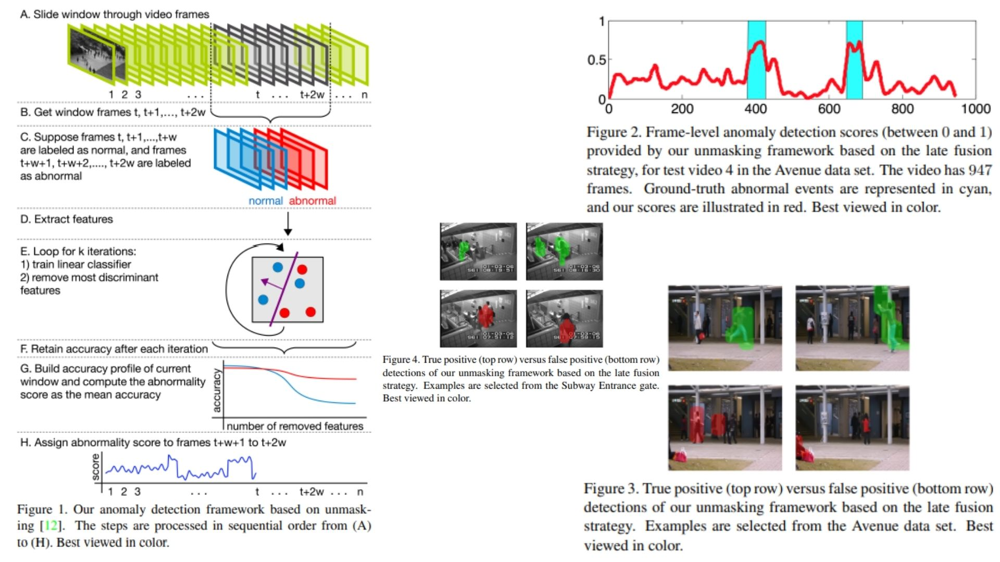

# 🎢 Unmasking-Anomaly-Detection — Unsupervised Video Anomaly Detection

This repository provides a **faithful Python implementation** of the **Unmasking framework** for abnormal event detection in video.  
The goal is to **replicate the theoretical model** from the paper without training/testing on large datasets.  

The code is modular, interpretable, and ideal for **research, experimentation, or educational purposes**.

Highlights include:

* Fully **unsupervised anomaly detection** 🕵️‍♂️  
* Iterative **feature unmasking** to reveal subtle changes ⚡  
* Combines **motion & appearance features** via late fusion 🔄  

Paper reference: *[Unmasking the Abnormal Events in Video](https://arxiv.org/abs/1705.08182)*  

---

## Overview — Unmasking Framework 🎨



> The framework analyzes a short video segment by comparing **consecutive frame windows**.  
> Motion and appearance features are extracted, iteratively trained with a **linear classifier**, and the most discriminant features are removed per loop.  
> Anomaly scores are computed from the **accuracy degradation profile**.

Key design principles:

* **Sliding window**: compares first half (reference) vs last half (test) of frames 🪟  
* **Motion features**: spatio-temporal cubes with 3D gradients 🌀  
* **Appearance features**: conv5 activations from pre-trained CNN (VGG-f) 🖼️  
* **Unmasking loop**: iteratively removes top features to assess anomaly depth 🔎  
* **Late fusion & smoothing**: combines scores and applies temporal Gaussian smoothing 🌊  

---

## Core Mathematical Formulations 📐

Given a window of frames:

$$
X = [X_\text{ref}, X_\text{test}]
$$

Labels:

$$
y = [0 \cdot |X_\text{ref}|, 1 \cdot |X_\text{test}|]
$$

Linear classifier training:

$$
\hat{y} = \text{LogisticRegression}(X, y)
$$

Unmasking iterations (top-m features removed per loop):

$$
X^{(k+1)} = X^{(k)} \setminus \text{TopFeatures}(X^{(k)})
$$

Accuracy profile over loops:

$$
\text{AccProfile} = [\text{Acc}^{(1)}, \text{Acc}^{(2)}, \dots, \text{Acc}^{(K)}]
$$

Anomaly score per window:

$$
\text{AnomalyScore} = \frac{1}{K} \sum_{i=1}^{K} \text{Acc}^{(i)}
$$

---

## Why Unmasking Matters 🌿

* Detects **subtle abnormal events** without any training data 🧩  
* Uses **both motion and appearance cues** for robust detection 🖼️🌀  
* Real-time capable: processes at **20 FPS on CPU** ⚡  
* Modular: easily extendable for new features or classifiers 🔧  

---

## Repository Structure 🏗️

```bash
Unmasking-Anomaly-Detection/
├── src/
│   ├── features/
│   │   ├── motion_features.py        # Spatio-temporal cubes + 3D gradient extraction
│   │   └── appearance_features.py    # Pre-trained CNN (VGG-f) conv5 activations
│   │
│   ├── unmasking/
│   │   ├── classifier.py             # Logistic Regression with high regularization
│   │   ├── unmasking_loop.py         # Iterative removal of top m features for k loops
│   │   └── anomaly_profile.py        # Accuracy profile construction & anomaly score calculation
│   │
│   ├── sliding_window/
│   │   └── windowing.py              # Sliding window generation (2*w frames), stride s
│   │
│   ├── fusion/
│   │   └── late_fusion.py            # Combine motion + appearance, 2x2 bins, max & average
│   │
│   ├── smoothing/
│   │   └── temporal_smoothing.py     # Gaussian smoothing of final frame anomaly scores
│   │
│   ├── model/
│   │   └── unmasking_framework.py    # Full pipeline assembly (steps A-H from paper)
│   │
│   └── config.py                     # Parameters: w, s, k, m, bin sizes, CNN model path
│
├── images/
│   └── figmix.jpg
│
├── requirements.txt
└── README.md
```

---

## 🔗 Feedback

For questions or feedback, contact:  
[barkin.adiguzel@gmail.com](mailto:barkin.adiguzel@gmail.com)
